# 🌱 WasteNexus

<div align="center">

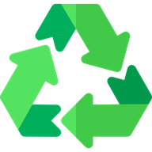

**Transform Waste Into Opportunity**

A comprehensive waste management platform connecting waste generators with environmental champions and waste collection professionals.

[](https://nextjs.org/)
[](https://www.typescriptlang.org/)
[](https://www.mongodb.com/)
[](https://tailwindcss.com/)
[](https://web.dev/progressive-web-apps/)

[Live Demo](#) • [Documentation](#features) • [Report Bug](#) • [Request Feature](#)

</div>

---

## 📋 Table of Contents

- [Overview](#-overview)
- [Key Features](#-key-features)
- [Screenshots](#-screenshots)
- [Tech Stack](#-tech-stack)
- [Architecture](#-architecture)
- [Getting Started](#-getting-started)
- [Environment Variables](#-environment-variables)
- [AI Integration](#-ai-integration)
- [API Documentation](#-api-documentation)
- [Database Schema](#-database-schema)
- [PWA Features](#-pwa-features)
- [Deployment](#-deployment)
- [Contributing](#-contributing)
- [Team](#-team)
- [License](#-license)

---

## 🌟 Overview

WasteNexus is a cutting-edge waste management platform that revolutionizes how communities handle waste collection and recycling. By connecting three key stakeholders - **Clients** (waste generators), **Champions** (environmental organizers), and **Workers** (collection professionals) - we create a sustainable ecosystem that rewards responsible waste management.

### 🎯 Mission

Reduce landfill waste, create environmental impact, and build a sustainable future by making waste management accessible, rewarding, and efficient.

### 🔑 Core Principles

- **🌍 Sustainability First**: Every feature designed to reduce environmental impact
- **💰 Reward-Based**: Gamification through points, badges, and leaderboards
- **🤖 AI-Powered**: Smart waste classification using Google Gemini AI
- **📱 Mobile-First**: Progressive Web App for seamless mobile experience
- **🔐 Secure**: Role-based access control and JWT authentication

---

## ✨ Key Features

### 👥 Multi-Role System

#### 🟢 For Clients (Individuals & Households)
- 📸 **Report Waste** with AI-powered classification
- 📍 **Location Picker** with auto-detect and manual selection
- 🏆 **Earn Rewards** - points for every kg of waste reported
- 🎖️ **Unlock Badges** and climb the leaderboard
- 🎪 **Join Events** - participate in community cleanup activities
- 💼 **Post Jobs** for waste collection services
- 🛍️ **Marketplace** - buy and sell recyclable items

#### 🔵 For Champions (NGOs & Organizations)
- 📅 **Create & Manage Events** - organize cleanup drives
- ✅ **Verify Reports** - review and approve waste submissions
- 📊 **Track Participation** - monitor community engagement
- 🏅 **Earn Points** for organizing successful events
- 📈 **Analytics Dashboard** - view event statistics

#### 🟣 For Workers (Waste Collection Professionals)
- 📋 **View Verified Reports** filtered by location (20km radius)
- ✅ **Complete Tasks** - mark reports as collected
- 💵 **Browse Jobs** - find waste collection opportunities
- 💰 **Track Earnings** - monitor completed tasks
- 📍 **Location-Based Filtering** - see only nearby reports
- 📊 **Work Statistics** - view performance metrics

#### 🔴 For Admins
- 👥 **User Management** - manage all user roles
- 🏪 **Marketplace Moderation** - approve/reject listings
- 📊 **Analytics & Reports** - platform-wide insights
- 🎪 **Event Management** - oversee all events
- 🖼️ **Gallery Management** - showcase success stories
- 💼 **Job Verification** - review job postings
- 🧾 **Transaction Monitoring** - track all point transactions
- 👷 **Worker Applications** - verify worker registrations

---

## 📸 Screenshots

### 🏠 Home & Landing

<div align="center">
  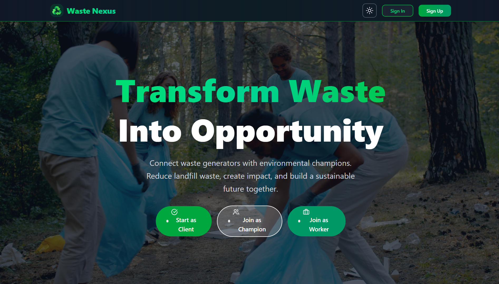
  <p><em>Modern landing page with role selection</em></p>
</div>

<div align="center">
  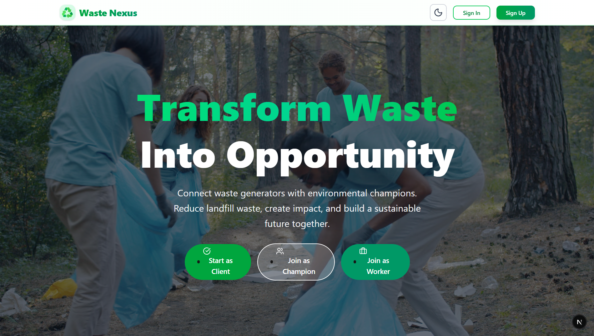
  <p><em>Modern landing page light mode</em></p>
</div>

### 🔐 Authentication

<div align="center">
  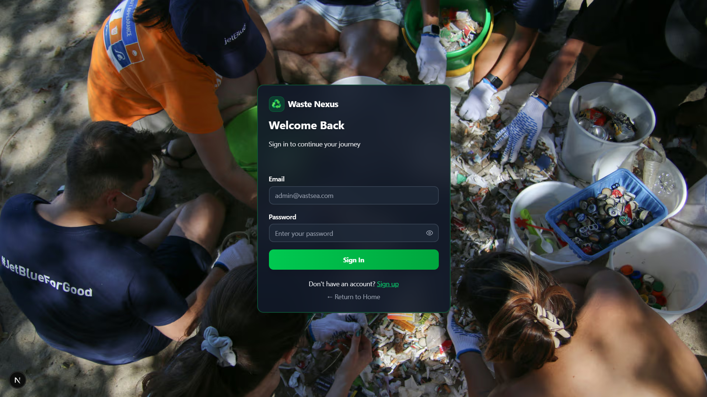
  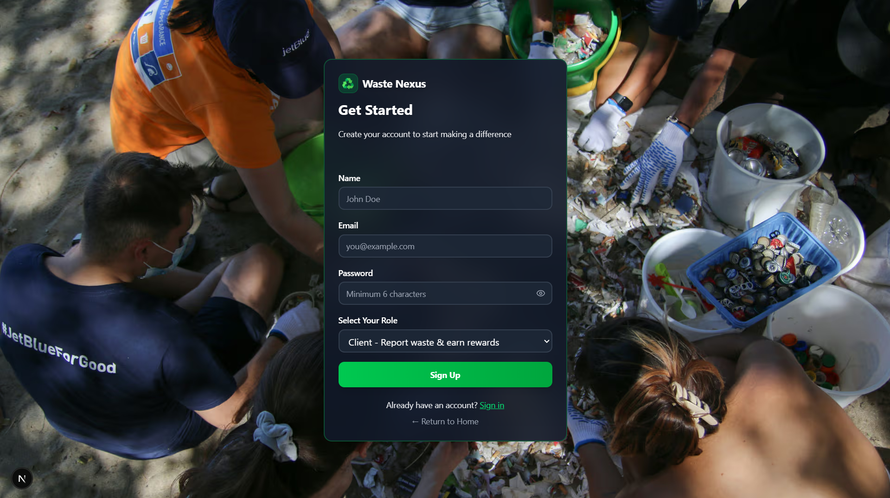
  <p><em>Clean authentication with role-based signup</em></p>
</div>

### 🔐 Role Selection
<div align="center">
  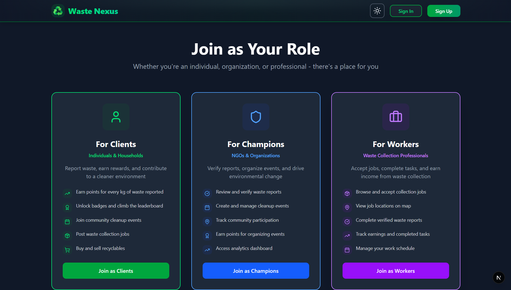
  <p><em>Role-based signup</em></p>
</div>


### 📊 Dashboards

#### Client Dashboard
<div align="center">
  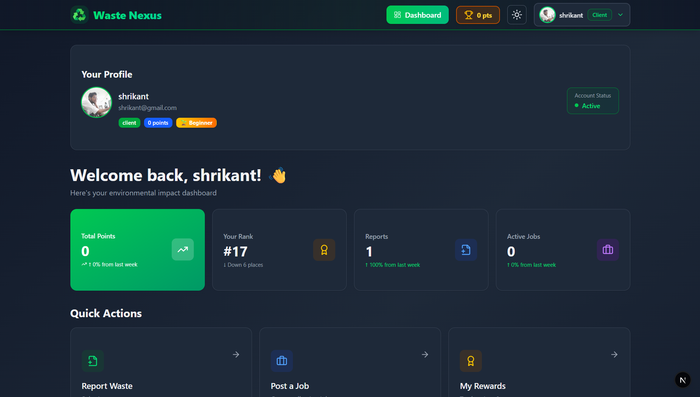
  <p><em>Personalized dashboard with points, rank, and quick actions</em></p>
</div>

#### Champion Dashboard
<div align="center">
  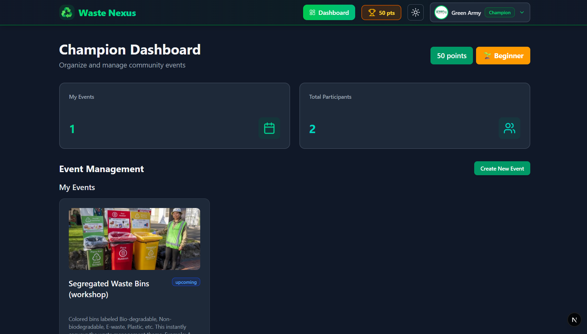
  <p><em>Event management with participant tracking</em></p>
</div>

#### Admin Dashboard
<div align="center">
  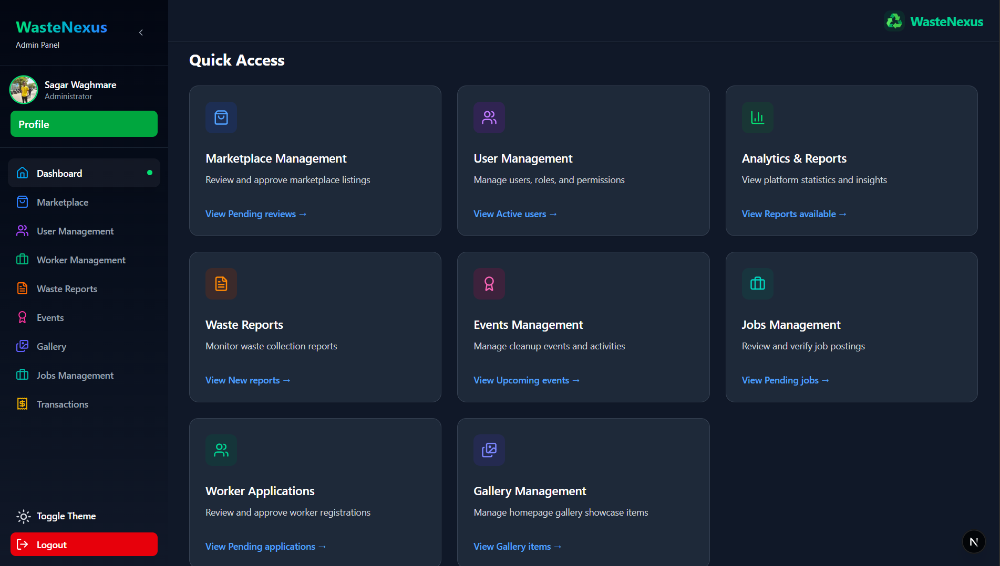
  <p><em>Comprehensive admin panel with quick access cards</em></p>
</div>

### 📝 Waste Reporting

<div align="center">
  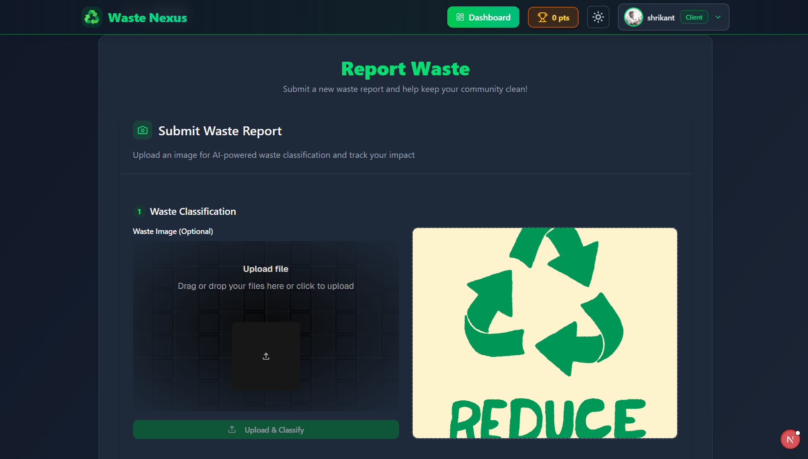
  <p><em>AI-powered waste classification with image upload</em></p>
</div>

### 🎪 Events Management

<div align="center">
  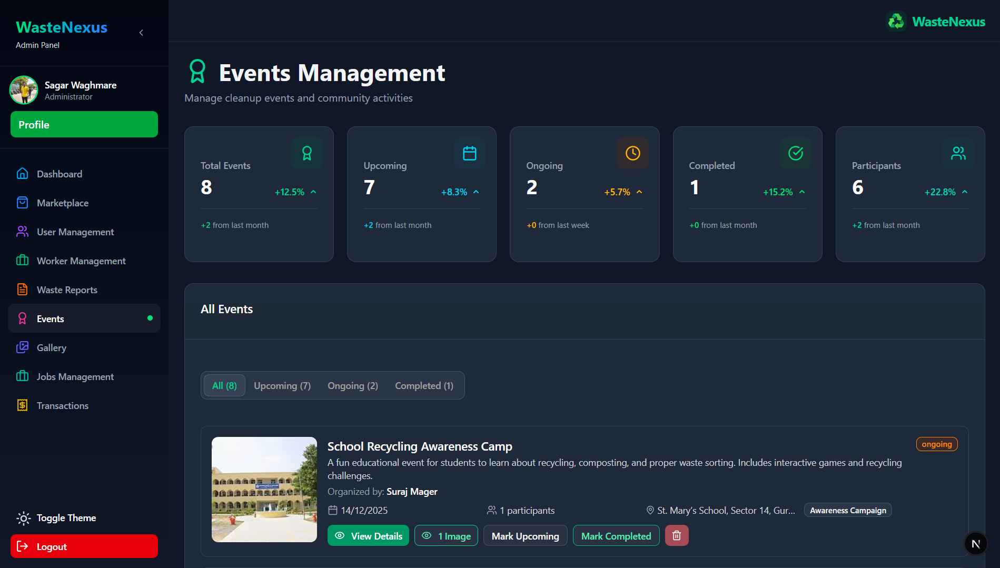
  <p><em>Event creation, tracking, and participant management</em></p>
</div>

### 🛍️ Marketplace

<div align="center">
  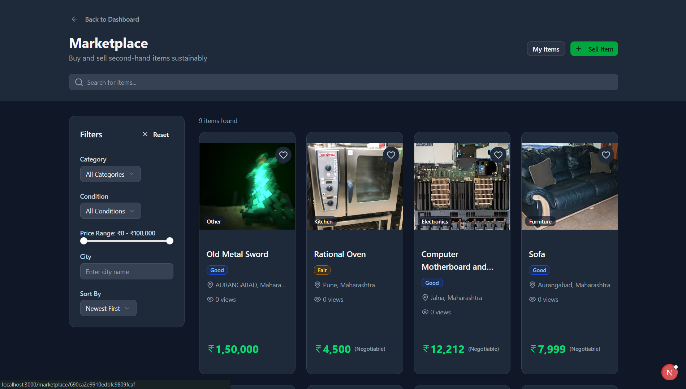
  <p><em>Buy and sell recyclable items sustainably</em></p>
</div>

### 🖼️ Gallery

<div align="center">
  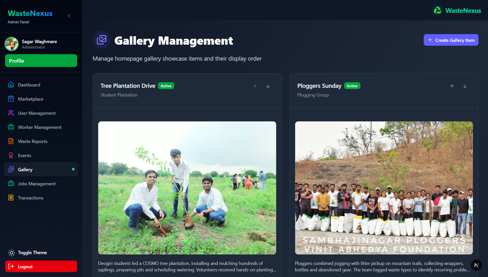
  <p><em>Showcase community success stories</em></p>
</div>

---

## 🛠️ Tech Stack

### Frontend
- **Framework**: [Next.js 15.5.5](https://nextjs.org/) (App Router, React 19, Turbopack)
- **Language**: [TypeScript 5](https://www.typescriptlang.org/)
- **Styling**: [Tailwind CSS 4](https://tailwindcss.com/) + [Framer Motion](https://www.framer.com/motion/)
- **UI Components**: [Radix UI](https://www.radix-ui.com/) + Custom Components
- **Form Handling**: [React Hook Form](https://react-hook-form.com/) + [Zod](https://zod.dev/)
- **Maps**: [@react-google-maps/api](https://react-google-maps-api-docs.netlify.app/)
- **Icons**: [Lucide React](https://lucide.dev/) + [@tabler/icons-react](https://tabler-icons.io/)
- **Notifications**: [Sonner](https://sonner.emilkowal.ski/)
- **PWA**: [next-pwa](https://github.com/shadowwalker/next-pwa)

### Backend
- **Runtime**: [Node.js](https://nodejs.org/) with Next.js API Routes
- **Database**: [MongoDB](https://www.mongodb.com/) with [Mongoose ODM](https://mongoosejs.com/)
- **Authentication**: [JWT](https://jwt.io/) + [bcryptjs](https://github.com/dcodeIO/bcrypt.js)
- **File Upload**: [Cloudinary](https://cloudinary.com/)
- **AI Integration**: [Google Gemini AI](https://ai.google.dev/) (vision & text models)
- **Email**: [Nodemailer](https://nodemailer.com/)

### DevOps & Tools
- **Version Control**: Git & GitHub
- **Package Manager**: npm
- **Linting**: ESLint 9
- **Code Formatting**: Prettier (via ESLint)
- **Build Tool**: Turbopack (Next.js 15)
- **Deployment**: Vercel / Netlify

---

## 🏗️ Architecture

### System Architecture

```
┌─────────────────────────────────────────────────────────────┐
│                     Client Layer (Browser)                   │
│  ┌──────────────┐  ┌──────────────┐  ┌──────────────┐      │
│  │   Next.js    │  │  React 19    │  │  TailwindCSS │      │
│  │  App Router  │  │  Components  │  │   Styling    │      │
│  └──────────────┘  └──────────────┘  └──────────────┘      │
└─────────────────────────────────────────────────────────────┘
                            ▼
┌─────────────────────────────────────────────────────────────┐
│                    API Layer (Next.js)                       │
│  ┌──────────────────────────────────────────────────────┐  │
│  │  Route Handlers (app/api/*)                          │  │
│  │  ├─ /auth/*        - Authentication                  │  │
│  │  ├─ /client/*      - Client operations               │  │
│  │  ├─ /champion/*    - Champion operations             │  │
│  │  ├─ /worker/*      - Worker operations               │  │
│  │  ├─ /admin/*       - Admin operations                │  │
│  │  └─ /upload/*      - File uploads (Cloudinary)       │  │
│  └──────────────────────────────────────────────────────┘  │
└─────────────────────────────────────────────────────────────┘
                            ▼
┌─────────────────────────────────────────────────────────────┐
│                   Business Logic Layer                       │
│  ┌─────────────┐  ┌─────────────┐  ┌─────────────┐        │
│  │  Auth (JWT) │  │   Rewards   │  │  AI Service │        │
│  │  Middleware │  │   System    │  │  (Gemini)   │        │
│  └─────────────┘  └─────────────┘  └─────────────┘        │
└─────────────────────────────────────────────────────────────┘
                            ▼
┌─────────────────────────────────────────────────────────────┐
│                    Data Layer (MongoDB)                      │
│  ┌──────────────────────────────────────────────────────┐  │
│  │  Collections:                                        │  │
│  │  ├─ users          - User accounts & profiles        │  │
│  │  ├─ reports        - Waste reports                   │  │
│  │  ├─ events         - Community events                │  │
│  │  ├─ jobs           - Waste collection jobs           │  │
│  │  ├─ transactions   - Point transactions              │  │
│  │  ├─ marketplaceItems - Recyclable items              │  │
│  │  ├─ gallery        - Success stories                 │  │
│  │  ├─ workerApplications - Worker registrations        │  │
│  │  └─ workerTasks    - Assigned collection tasks       │  │
│  └──────────────────────────────────────────────────────┘  │
└─────────────────────────────────────────────────────────────┘
```

### Data Flow

```
User Action → Next.js Page → API Route → Auth Middleware → 
Business Logic → Database (Mongoose) → Response → UI Update
```

---

## 🚀 Getting Started

### Prerequisites

- **Node.js** 20+ and npm
- **MongoDB** instance (local or Atlas)
- **Cloudinary** account for image uploads
- **Google Maps API** key
- **Google Gemini API** key

### Installation

1. **Clone the repository**
   ```bash
   git clone https://github.com/SagarSuryakantWaghmare/wastenexus.git
   cd wastenexus
   ```

2. **Install dependencies**
   ```bash
   npm install
   ```

3. **Set up environment variables**
   
   Create a `.env.local` file in the root directory:
   ```bash
   cp .env.example .env.local
   ```
   
   Fill in all required variables (see [Environment Variables](#-environment-variables))

4. **Run database migrations** (if needed)
   ```bash
   npm run migrate-coordinates
   ```

5. **Start development server**
   ```bash
   npm run dev
   ```

6. **Open your browser**
   
   Navigate to [http://localhost:3000](http://localhost:3000)

### Building for Production

```bash
# Build the application
npm run build

# Start production server
npm start
```

### Running Scripts

```bash
# Add admin users
npm run add-admins

# Test email configuration
npm run test:email

# Validate SEO
npm run seo:validate

# Run Lighthouse CI
npm run lighthouse
```

---

## 🔐 Environment Variables

Create a `.env.local` file with the following variables:

### Core Configuration
```env
# App
NEXT_PUBLIC_BASE_URL=http://localhost:3000
NODE_ENV=development

# MongoDB
MONGODB_URI=mongodb://localhost:27017/wastenexus
# OR for MongoDB Atlas:
# MONGODB_URI=mongodb+srv://<username>:<password>@cluster.mongodb.net/wastenexus

# JWT Secret (generate a strong random string)
JWT_SECRET=your-super-secret-jwt-key-change-this-in-production
```

### Third-Party Services
```env
# Cloudinary (for image uploads)
CLOUDINARY_CLOUD_NAME=your-cloud-name
CLOUDINARY_API_KEY=your-api-key
CLOUDINARY_API_SECRET=your-api-secret

# Google Maps
NEXT_PUBLIC_GOOGLE_MAPS_API_KEY=your-google-maps-api-key

# Google Gemini AI
GEMINI_API_KEY=your-gemini-api-key

# Email (Nodemailer - Gmail example)
EMAIL_HOST=smtp.gmail.com
EMAIL_PORT=587
EMAIL_USER=your-email@gmail.com
EMAIL_PASS=your-app-password
EMAIL_FROM=WasteNexus <noreply@wastenexus.com>
```

### Optional Configuration
```env
# Analytics
NEXT_PUBLIC_GA_ID=G-XXXXXXXXXX

# PWA
NEXT_PUBLIC_MANIFEST_URL=/manifest.json
```

> ⚠️ **Security Note**: Never commit `.env.local` to version control. Add it to `.gitignore`.

---

## 🤖 AI Integration

WasteNexus leverages **Google Gemini AI** for intelligent waste classification:

### Features

1. **🖼️ Vision-Based Classification**
   - Upload waste images for automatic type detection
   - Returns waste type, confidence score, and recyclability status
   - Provides detailed descriptions and handling recommendations

2. **🎯 Smart Categorization**
   - Classifies into: Plastic, Paper, Glass, Metal, E-Waste, Organic, Mixed
   - Confidence threshold validation (minimum 60%)
   - Fallback to manual selection if confidence is low

3. **💡 Implementation**

```typescript
// lib/gemini.ts
import { GoogleGenerativeAI } from '@google/generative-ai';

const genAI = new GoogleGenerativeAI(process.env.GEMINI_API_KEY!);

export async function classifyWaste(imageUrl: string) {
  const model = genAI.getGenerativeModel({ model: "gemini-1.5-flash" });
  
  const prompt = `Analyze this waste image and classify it...`;
  
  const result = await model.generateContent([prompt, imagePart]);
  // Returns: { type, confidence, description, recyclable }
}
```

### API Endpoint

```typescript
POST /api/upload/image
Content-Type: multipart/form-data

Body: { image: File }

Response: {
  success: true,
  imageUrl: "https://...",
  classification: {
    type: "Plastic",
    confidence: 0.95,
    description: "PET bottle, recyclable",
    recyclable: true
  }
}
```

---

## 📡 API Documentation

### Authentication

All protected routes require JWT token in Authorization header:
```
Authorization: Bearer <your-jwt-token>
```

### Core Endpoints

#### 🔐 Auth
- `POST /api/auth/signup` - Register new user
- `POST /api/auth/login` - Login user (returns JWT)

#### 👤 User
- `GET /api/user` - Get current user profile
- `PATCH /api/user/profile` - Update profile
- `GET /api/user/transactions` - Get point transactions

#### 📝 Reports (Client)
- `POST /api/reports` - Submit waste report
- `GET /api/reports` - Get user's reports

#### ✅ Reports (Admin/Champion)
- `GET /api/admin/reports` - List all reports
- `POST /api/reports/[id]/verify` - Verify report (awards points)

#### 🎪 Events
- `GET /api/events` - List public events
- `POST /api/events` - Create event (Champion)
- `GET /api/events/[id]` - Get event details
- `POST /api/events/[id]/join` - Join event
- `GET /api/events/mine` - Get user's created events

#### 💼 Jobs
- `GET /api/jobs` - Browse jobs
- `POST /api/jobs` - Create job (Client)

#### 🛍️ Marketplace
- `GET /api/marketplace` - List items (with filters)
- `POST /api/marketplace` - Create listing
- `GET /api/marketplace/[id]` - Item details
- `POST /api/marketplace/[id]/buy` - Purchase item

#### 👷 Worker
- `GET /api/worker/verified-reports` - List verified reports (location-filtered)
- `POST /api/worker/complete-report` - Mark report as collected
- `GET /api/worker/tasks` - Get assigned tasks
- `GET /api/worker/jobs` - Browse available jobs

#### 🔴 Admin
- `GET /api/admin/users` - User management
- `DELETE /api/admin/users` - Delete user
- `GET /api/admin/dashboard-stats` - Platform statistics
- `GET /api/admin/marketplace/pending` - Pending listings
- `POST /api/admin/marketplace/[id]/verify` - Approve listing
- `GET /api/admin/worker-applications` - Worker applications
- `POST /api/admin/worker-applications/[id]` - Verify worker

### Response Format

**Success:**
```json
{
  "success": true,
  "data": { ... },
  "message": "Operation successful"
}
```

**Error:**
```json
{
  "error": "Error message",
  "details": { ... }
}
```

---

## 🗄️ Database Schema

### User Model
```typescript
{
  _id: ObjectId,
  name: string,
  email: string (unique),
  password: string (hashed),
  role: 'client' | 'champion' | 'admin' | 'worker',
  profileImage?: string,
  totalPoints: number,
  createdAt: Date,
  updatedAt: Date
}
```

### Report Model
```typescript
{
  _id: ObjectId,
  userId: ObjectId (ref: User),
  type: 'Plastic' | 'Paper' | 'Glass' | 'Metal' | 'E-Waste' | 'Organic' | 'Mixed',
  weightKg: number,
  imageUrl?: string,
  location: {
    address: string,
    latitude: number,
    longitude: number,
    coordinates?: { lat: number, lng: number }
  },
  status: 'pending' | 'verified' | 'rejected',
  pointsAwarded: number,
  verifiedBy?: ObjectId (ref: User),
  verifiedAt?: Date,
  createdAt: Date,
  updatedAt: Date
}
```

### Event Model
```typescript
{
  _id: ObjectId,
  championId: ObjectId (ref: User),
  title: string,
  description: string,
  location: string,
  locations: string[],
  date: Date,
  images: string[],
  maxParticipants: number,
  participants: ObjectId[] (ref: User),
  status: 'upcoming' | 'ongoing' | 'completed' | 'cancelled',
  pointsReward: number,
  createdAt: Date,
  updatedAt: Date
}
```

### Job Model
```typescript
{
  _id: ObjectId,
  clientId: ObjectId (ref: User),
  title: string,
  description: string,
  category: 'industry' | 'home' | 'other',
  location: {
    address: string,
    coordinates: { lat: number, lng: number }
  },
  wasteType: string[],
  estimatedWeight?: number,
  budget?: number,
  urgency: 'low' | 'medium' | 'high',
  status: 'open' | 'in-progress' | 'completed' | 'cancelled',
  applicants: ObjectId[] (ref: User),
  assignedTo?: ObjectId (ref: User),
  createdAt: Date,
  updatedAt: Date
}
```

### MarketplaceItem Model
```typescript
{
  _id: ObjectId,
  sellerId: ObjectId (ref: User),
  title: string,
  description: string,
  category: 'Electronics' | 'Furniture' | 'Kitchen' | 'Books' | 'Clothing' | 'Other',
  price: number,
  condition: 'new' | 'like-new' | 'good' | 'fair' | 'poor',
  images: string[],
  location: string,
  status: 'pending' | 'active' | 'sold' | 'rejected',
  views: number,
  favorites: ObjectId[] (ref: User),
  createdAt: Date,
  updatedAt: Date
}
```

### Transaction Model
```typescript
{
  _id: ObjectId,
  userId: ObjectId (ref: User),
  type: 'waste_report' | 'event_participation' | 'event_organization' | 'job_completion' | 'admin_adjustment',
  amount: number,
  description: string,
  relatedId?: ObjectId,
  createdAt: Date
}
```

### WorkerApplication Model
```typescript
{
  _id: ObjectId,
  name: string,
  email: string,
  phone: string,
  address: string,
  photo?: { public_id: string, secure_url: string },
  aadhaarCard?: { public_id: string, secure_url: string },
  status: 'pending' | 'verified' | 'rejected',
  rejectionReason?: string,
  userId?: ObjectId (ref: User),
  appliedAt: Date,
  verifiedAt?: Date,
  verifiedBy?: ObjectId (ref: User)
}
```

### WorkerTask Model
```typescript
{
  _id: ObjectId,
  reportId: ObjectId (ref: Report),
  workerId: ObjectId (ref: User),
  status: 'assigned' | 'in-progress' | 'completed',
  assignedDate: Date,
  startedDate?: Date,
  completedDate?: Date,
  createdAt: Date,
  updatedAt: Date
}
```

---

## 📱 PWA Features

WasteNexus is a **Progressive Web App** with offline capabilities:

### Features
- ✅ **Installable** - Add to home screen on mobile/desktop
- ✅ **Offline Support** - Service worker caching
- ✅ **Push Notifications** (planned)
- ✅ **Background Sync** (planned)
- ✅ **App-like Experience** - Full-screen mode

### Manifest Configuration
```json
{
  "name": "WasteNexus",
  "short_name": "WasteNexus",
  "description": "Transform Waste Into Opportunity",
  "start_url": "/",
  "display": "standalone",
  "background_color": "#ffffff",
  "theme_color": "#10b981",
  "icons": [
    {
      "src": "/icons/icon-192x192.png",
      "sizes": "192x192",
      "type": "image/png",
      "purpose": "any maskable"
    },
    {
      "src": "/icons/icon-512x512.png",
      "sizes": "512x512",
      "type": "image/png",
      "purpose": "any maskable"
    }
  ]
}
```

### Install Prompt
The app shows a custom install prompt after:
- ✅ 10 seconds initial delay
- ✅ 24-hour cooldown between prompts
- ✅ User dismissal tracking

---

## 🚀 Deployment

### Vercel (Recommended)

1. **Push to GitHub**
   ```bash
   git push origin main
   ```

2. **Import to Vercel**
   - Go to [vercel.com](https://vercel.com)
   - Import your GitHub repository
   - Configure environment variables
   - Deploy!

3. **Configure Domains**
   - Add custom domain in Vercel settings
   - Update `NEXT_PUBLIC_BASE_URL` in environment variables

### Netlify

1. **Build Command**: `npm run build`
2. **Publish Directory**: `.next`
3. **Environment Variables**: Add all from `.env.local`

### Self-Hosted

```bash
# Build the app
npm run build

# Start with PM2
pm2 start npm --name "wastenexus" -- start
```

---

## 🤝 Contributing

We welcome contributions! Here's how you can help:

### Development Workflow

1. **Fork the repository**
   ```bash
   git clone https://github.com/YOUR_USERNAME/wastenexus.git
   ```

2. **Create a feature branch**
   ```bash
   git checkout -b feature/amazing-feature
   ```

3. **Make your changes**
   - Follow the existing code style
   - Add tests if applicable
   - Update documentation

4. **Commit your changes**
   ```bash
   git commit -m "Add amazing feature"
   ```

5. **Push to your fork**
   ```bash
   git push origin feature/amazing-feature
   ```

6. **Open a Pull Request**
   - Describe your changes clearly
   - Reference any related issues

### Code Style

- **TypeScript**: Strict mode enabled
- **Formatting**: ESLint + Prettier
- **Naming**: camelCase for variables, PascalCase for components
- **Commits**: Follow [Conventional Commits](https://www.conventionalcommits.org/)

### Areas to Contribute

- 🐛 **Bug Fixes** - Report and fix bugs
- ✨ **Features** - Add new functionality
- 📝 **Documentation** - Improve docs
- 🎨 **UI/UX** - Enhance user interface
- ♿ **Accessibility** - Make the app more accessible
- 🌍 **Internationalization** - Add language support
- ⚡ **Performance** - Optimize speed and efficiency

---

## 👥 Team

### Core Team

<table>
  <tr>
    <td align="center">
      <br />
      <sub><b>Sagar Suryakant Waghmare</b></sub><br />
      <sub>Full Stack Developer</sub><br />
      <a href="https://github.com/SagarSuryakantWaghmare">GitHub</a>
    </td>
    <td align="center">
      <br />
      <sub><b>Aakash Sonar</b></sub><br />
      <sub>Database Designer</sub><br />
      <a href="https://github.com/SonarAkash">GitHub</a>
    </td>
    <td align="center">
      <br />
      <sub><b>Soham Pawar</b></sub><br />
      <sub>Frontend Developer</sub><br />
      <a href="https://github.com/kkrishhh">GitHub</a>
    </td>
  </tr>
</table>

### Roles & Responsibilities

**Sagar Suryakant Waghmare** - *Full Stack Developer*
- 🏗️ Architecture & system design
- 💻 Frontend development (Next.js, React, TailwindCSS)
- 🔧 Backend development (API routes, authentication)
- 🤖 AI integration (Google Gemini)
- 📱 PWA implementation
- 🚀 DevOps & deployment

**Aakash Sonar** - *Database Designer*
- 🗄️ MongoDB schema design
- 📊 Data modeling & optimization
- 🔍 Query performance tuning
- 🔐 Data security & validation
- 📈 Database scaling strategies

**Soham Pawar** - *Frontend Developer*
- 🎨 UI/UX-focused interface design
- ⚡ Performance-optimized frontend development
- 🧩 Reusable component architecture
- 🛠️ Debugging & issue resolution
- 🚀 Continuous improvement & modern tech adoption

---

## 📄 License

This project is licensed under the **MIT License** - see the [LICENSE](LICENSE) file for details.

```
MIT License

Copyright (c) 2025 WasteNexus Team

Permission is hereby granted, free of charge, to any person obtaining a copy
of this software and associated documentation files (the "Software"), to deal
in the Software without restriction...
```

---

## 🙏 Acknowledgments

- **Google Gemini AI** - For intelligent waste classification
- **Cloudinary** - For image hosting and optimization
- **MongoDB** - For flexible database solutions
- **Vercel** - For seamless deployment
- **Next.js Team** - For the amazing framework
- **Open Source Community** - For incredible tools and libraries

---

## 📞 Contact & Support

- **GitHub Issues**: [Report a bug](https://github.com/SagarSuryakantWaghmare/wastenexus/issues)

---


<div align="center">

### Made with 💚 for a sustainable future

**⭐ Star this repo if you find it helpful!**

[Report Bug](https://github.com/SagarSuryakantWaghmare/wastenexus/issues) · [Request Feature](https://github.com/SagarSuryakantWaghmare/wastenexus/issues) · 

© 2025 WasteNexus. All rights reserved.

</div>
